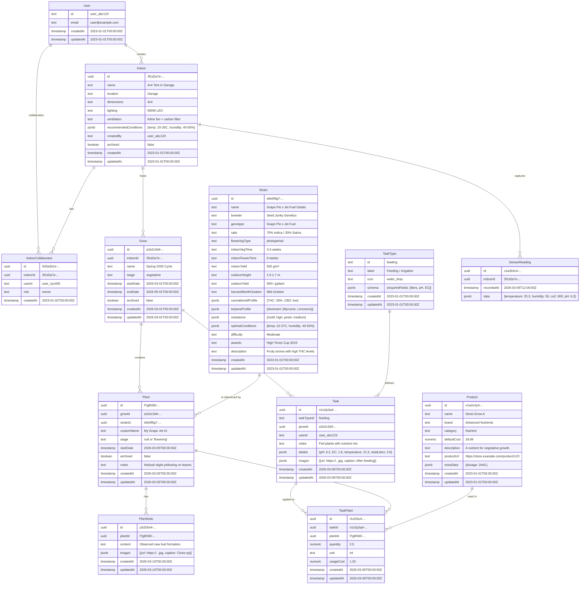

```mermaid
erDiagram
    User {
      text id "user_abc123"
      text email "user@example.com"
      timestamp createdAt "2023-01-01T00:00:00Z"
      timestamp updatedAt "2023-01-01T00:00:00Z"
    }

    Indoor {
      uuid id "3f1d2a7e-..."
      text name "4x4 Tent in Garage"
      text location "Garage"
      text dimensions "4x4"
      text lighting "600W LED"
      text ventilation "Inline fan + carbon filter"
      jsonb recommendedConditions "{temp: 20-26C, humidity: 40-50%}"
      text createdBy "user_abc123"
      boolean archived "false"
      timestamp createdAt "2023-01-01T00:00:00Z"
      timestamp updatedAt "2023-01-01T00:00:00Z"
    }

    IndoorCollaborator {
      uuid id "5d3a2b1e-..."
      uuid indoorId "3f1d2a7e-..."
      text userId "user_xyz456"
      text role "owner"
      timestamp createdAt "2023-01-02T00:00:00Z"
    }

    Grow {
      uuid id "a1b2c3d4-..."
      uuid indoorId "3f1d2a7e-..."
      text name "Spring 2026 Cycle"
      text stage "vegetative"
      timestamp startDate "2026-03-01T00:00:00Z"
      timestamp endDate "2026-05-01T00:00:00Z"
      boolean archived "false"
      timestamp createdAt "2026-03-01T00:00:00Z"
      timestamp updatedAt "2026-03-01T00:00:00Z"
    }

    Strain {
      uuid id "d4e5f6g7-..."
      text name "Grape Pie x Jet Fuel Gelato"
      text breeder "Seed Junky Genetics"
      text genotype "Grape Pie x Jet Fuel"
      text ratio "70% Indica / 30% Sativa"
      text floweringType "photoperiod"
      text indoorVegTime "3-4 weeks"
      text indoorFlowerTime "9 weeks"
      text indoorYield "500 g/m²"
      text outdoorHeight "1.5-1.7 m"
      text outdoorYield "500+ g/plant"
      text harvestMonthOutdoor "Mid-October"
      jsonb cannabinoidProfile "{THC: 29%, CBD: low}"
      jsonb terpeneProfile "{dominant: [Myrcene, Limonene]}"
      jsonb resistance "{mold: high, pests: medium}"
      jsonb optimalConditions "{temp: 22-27C, humidity: 40-50%}"
      text difficulty "Moderate"
      text awards "High Times Cup 2019"
      text description "Fruity aroma with high THC levels."
      timestamp createdAt "2023-01-01T00:00:00Z"
      timestamp updatedAt "2023-01-01T00:00:00Z"
    }

    Plant {
      uuid id "f7g8h9i0-..."
      uuid growId "a1b2c3d4-..."
      uuid strainId "d4e5f6g7-..."
      text customName "My Grape Jet #1"
      text stage "null or 'flowering'"
      timestamp startDate "2026-03-05T00:00:00Z"
      boolean archived "false"
      text notes "Noticed slight yellowing on leaves"
      timestamp createdAt "2026-03-05T00:00:00Z"
      timestamp updatedAt "2026-03-05T00:00:00Z"
    }

    PlantNote {
      uuid id "j1k2l3m4-..."
      uuid plantId "f7g8h9i0-..."
      text content "Observed new bud formation."
      jsonb images "[{url: https://...jpg, caption: Close-up}]"
      timestamp createdAt "2026-03-10T00:00:00Z"
      timestamp updatedAt "2026-03-10T00:00:00Z"
    }

    TaskType {
      text id "feeding"
      text label "Feeding / Irrigation"
      text icon "water_drop"
      jsonb schema "{requiredFields: [liters, pH, EC]}"
      timestamp createdAt "2023-01-01T00:00:00Z"
      timestamp updatedAt "2023-01-01T00:00:00Z"
    }

    Task {
      uuid id "n1o2p3q4-..."
      text taskTypeId "feeding"
      uuid growId "a1b2c3d4-..."
      text userId "user_abc123"
      text notes "Fed plants with nutrient mix"
      jsonb details "{pH: 6.2, EC: 1.8, temperature: 21.5, totalLiters: 3.0}"
      jsonb images "[{url: https://...jpg, caption: After feeding}]"
      timestamp createdAt "2026-03-06T00:00:00Z"
      timestamp updatedAt "2026-03-06T00:00:00Z"
    }

    TaskPlant {
      uuid id "r1s2t3u4-..."
      uuid taskId "n1o2p3q4-..."
      uuid plantId "f7g8h9i0-..."
      numeric quantity "2.5"
      text unit "ml"
      numeric usageCost "1.20"
      timestamp createdAt "2026-03-06T00:00:00Z"
      timestamp updatedAt "2026-03-06T00:00:00Z"
    }

    Product {
      uuid id "v1w2x3y4-..."
      text name "Sensi Grow A"
      text brand "Advanced Nutrients"
      text category "Nutrient"
      numeric defaultCost "29.99"
      text description "A nutrient for vegetative growth."
      text productUrl "https://store.example.com/product/123"
      jsonb extraData "{dosage: 2ml/L}"
      timestamp createdAt "2023-01-01T00:00:00Z"
      timestamp updatedAt "2023-01-01T00:00:00Z"
    }

    SensorReading {
      uuid id "z1a2b3c4-..."
      uuid indoorId "3f1d2a7e-..."
      timestamp recordedAt "2026-03-06T12:00:00Z"
      jsonb data "{temperature: 25.3, humidity: 50, co2: 800, pH: 6.2}"
    }

    %% Relationships
    User ||--o{ Indoor : "creates"
    User ||--o{ IndoorCollaborator : "collaborates"
    Indoor ||--o{ IndoorCollaborator : "has"
    Indoor ||--o{ Grow : "hosts"
    Grow ||--o{ Plant : "contains"
    Strain ||--o{ Plant : "is referenced by"
    Plant ||--o{ PlantNote : "has"
    Grow ||--o{ Task : "records"
    TaskType ||--|{ Task : "defines"
    Task ||--o{ TaskPlant : "applies to"
    Plant ||--o{ TaskPlant : "linked via"
    Product ||--o{ TaskPlant : "used in"
    Indoor ||--o{ SensorReading : "captures"
```
